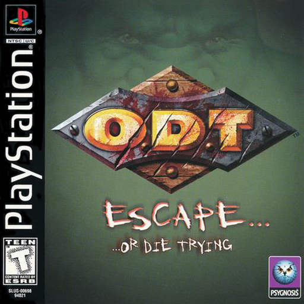

# O.D.T. (Or Die Trying) - Recompilation Project

<!-- retcomm-readme-metrics -->
[](https://github.com/Cyanoxide/odt-recomp)
[](https://github.com/mstan/psxrecomp)
[](https://github.com/Cyanoxide/odt-recomp/commits)
<!-- /retcomm-readme-metrics -->

---

<!-- coverage-progress -->

<!-- /coverage-progress -->

---

<br>

<!-- retcomm-readme-boxart -->
<p align="center">
  
</p>
<!-- /retcomm-readme-boxart -->


A simple recompilation project for the PS1 game O.D.T. (Or Die Trying) built using
[psxrecomp](https://github.com/mstan/psxrecomp) and
[recomp-ui](https://github.com/RetroPortingToolKit/recomp-ui).

| | |
|---|---|
| Players | 1 |
| Region | USA |
| Publisher | Psygnosis |
| Year | 1998 |


<!-- retcomm-readme-launcher -->
## Retro Launcher

You can run this title **standalone** (release zip + the built-in recomp-ui
Generate & Build flow), or manage installs, updates, ROM/BIOS wiring, and queued
builds more intuitively with
**[Retro Launcher](https://github.com/RetroPortingToolKit/Retro-Launcher)** —
the Retro Compilation Manager hub for self-compiling recomps.

[Downloads](https://github.com/RetroPortingToolKit/Retro-Launcher/releases) ·
[Full README & features](https://github.com/RetroPortingToolKit/Retro-Launcher#readme)

<p align="center">
  
</p>

<p align="center">
  
</p>

Retro checks for updates, rebuilds with existing build data when possible,
shares the portable toolchain used by per-title launchers, and automates
BIOS/ROM/save plumbing so you are not stuck repeating each game’s wizard by hand.
<!-- /retcomm-readme-launcher -->

## Quick start (dev)

```bash
git submodule update --init --recursive
./psxrecomp/tools/ci/build_emitters.sh
python3 psxrecomp/psxrecomp_cli.py generate \
  --config game.toml --project-root . --disc disc/<your>.cue
cmake -S . -B build-release -G Ninja -DCMAKE_BUILD_TYPE=Release
cmake --build build-release --target psx-runtime
```

## Legal

You must own the original game. Disc images under `disc/` are gitignored and
must never be committed. Retail BIOS dumps are not redistributed; OpenBIOS is
used for Generate unless you supply your own SCPH locally.

Default app icon: `assets/psxrecomp.ico` (and `.png` / `.svg`) — Retro-themed controller mark from `psxrecomp/assets/`. Windows builds embed it via `APP_ICON`.

Optional box art under `launcher_assets/img/` may come from
[libretro-thumbnails](https://github.com/libretro-thumbnails/libretro-thumbnails)
(`Named_Boxarts`); see `BOXART_SOURCE.txt` when present.


